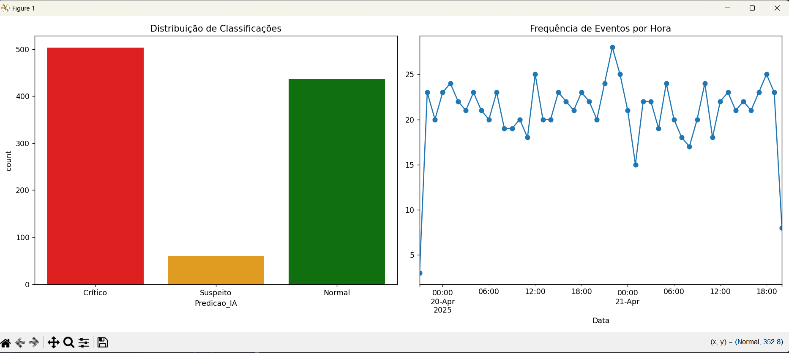
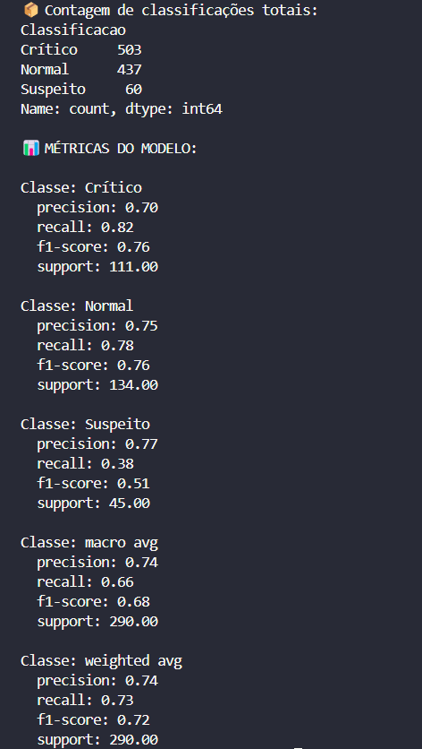

# Winlog Classifier

## 1. Descrição do Projeto

O **Winlog Classifier** é um programa desenvolvido em Python que realiza a **classificação automatizada de logs de aplicativos do Windows**. A ferramenta combina:

* **Regras pré-definidas** baseadas em Event ID (identificador de evento do Windows);
* **Modelos leves de Machine Learning** (implementados com `scikit-learn`).

O sistema identifica e alerta sobre logs com indícios de criticidade, além de gerar gráficos e relatórios de desempenho do classificador.

## 2. Objetivos

1. Automatizar a análise de logs de sistemas Windows.
2. Classificar logs de acordo com seu nível de criticidade.
3. Emitir alertas para logs críticos.
4. Fornecer métricas de avaliação (precisão, recall e F1-score).
5. Visualizar resultados por meio de gráficos.

## 3. Tecnologias Utilizadas

* **Python 3.6+**
* **scikit-learn**: criação e aplicação de modelos de ML;
* **pandas**: manipulação de dados;
* **matplotlib**, **seaborn**: geração de gráficos.
* **nltk**: processamento de linguagem natural

Todas as dependências estão listadas em `requirements.txt`.

## 4. Estrutura de Diretórios

```
winlog-classifier/
├── app/
│   ├── docs/                   # Documentos e ambiente
│   │   ├── logAppsWindows.txt  # Regras e mapeamentos de Event IDs
│   │   ├── massive_logs_windows.txt  # Exemplo de logs
│   │   └── requirements.txt    # Dependências Python
│   └── src/                    # Código-fonte
│       ├── classifiers/        # Implementação de classificadores
│       │   ├── rule_based.py   # Classificador baseado em regras
│       │   └── __pycache__/
│       ├── data_loader.py      # Carregamento e pré-processamento de dados
│       ├── ml_model.py         # Definição e treino de modelo ML
│       ├── preprocessor.py     # Limpeza e transformação de dados
│       ├── main.py             # Ponto de entrada da aplicação
│       ├── no_ia.py            # Fluxo sem uso de IA (apenas regras)
│       └── simuladorDeLogs.py  # Gerador de logs de teste
├── .gitignore
└── README.md                   # Este arquivo
```

## 5. Pré-requisitos

* Python 3.6 ou superior instalado.
* `pip` para instalação de pacotes.
* Acesso ao terminal (PowerShell, Bash, etc.).

## 6. Passo a Passo para Rodar o Projeto

1. **Clonar o repositório**:

   ```bash
   git clone https://github.com/murilosolino/winlog-classifier.git
   cd winlog-classifier
   ``
3. **Instalar dependências**:

   ```bash
   pip install pandas
   pip install nltk
   pip install matplotlib
   pip install seaborn
   pip install scikit-learn
   ```

4. **Preparar os dados de logs**:

   * Por padrão, o arquivo de exemplo `massive_logs_windows.txt` já está pronto em `app/docs/`.
   * Caso deseje é possível gerar um novo arquivo rodando o script **simuladorDeLogs.py**

5. **Executar Projeto**
    * Para executar o Projeto utilize os seguintes comandos uma vez estando no diretorio `winlog-classifier`.
    * cd app
    * py main.py 

    * Para executar o exemplo sem o uso de IA utilize os seguintes comandos uma vez estando no diretorio `winlog-classifier`
    * cd app
    * py no_ia.py 

6. **Visualizar resultados**:

   * Alertas de criticidade serão exibidos no terminal.
   * Gráficos de status geral dos logs e relatório de performance estarão em `results/`.
   

7. **(Opcional) Ajustes do Modelo**:

   * Dentro de `app/classifier.py`, modifique parâmetros como `test_size` e `random_state` para experimentar diferentes divisões de treino/teste.


## 📸 Demonstrações

### Resultados via gráficos


### Resultados via console


* Essas métricas permitem avaliar o desempenho do classificador em diferentes cenários.

## 🧠 Disciplinas Envolvidas

- Linguagens Formais e Autômatos


## 👥 Equipe

* **Cauã Pacheco de Souza**
* **Murilo Almeida Solino de Oliveira**

## 🏫 Informações Acadêmicas

- Universidade: **Universidade Braz Cubas**
- Curso: **Ciência da Computação**
- Semestre: 7º
- Período: Noite
- Professora orientadora: **Dra. Andréa Ono Sakai**
- Evento: **Mostra de Tecnologia 1º Semestre de 2025**
- Local: Laboratório 12
- Datas: 05 e 06 de junho de 2025

## 📄 Licença

MIT License — sinta-se à vontade para utilizar, estudar e adaptar este projeto.
